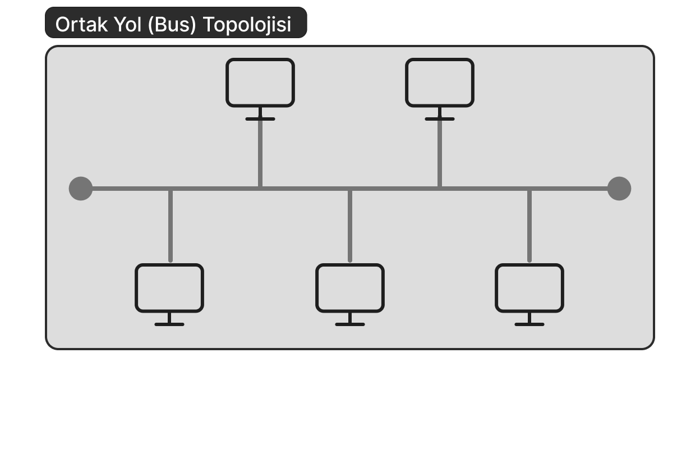
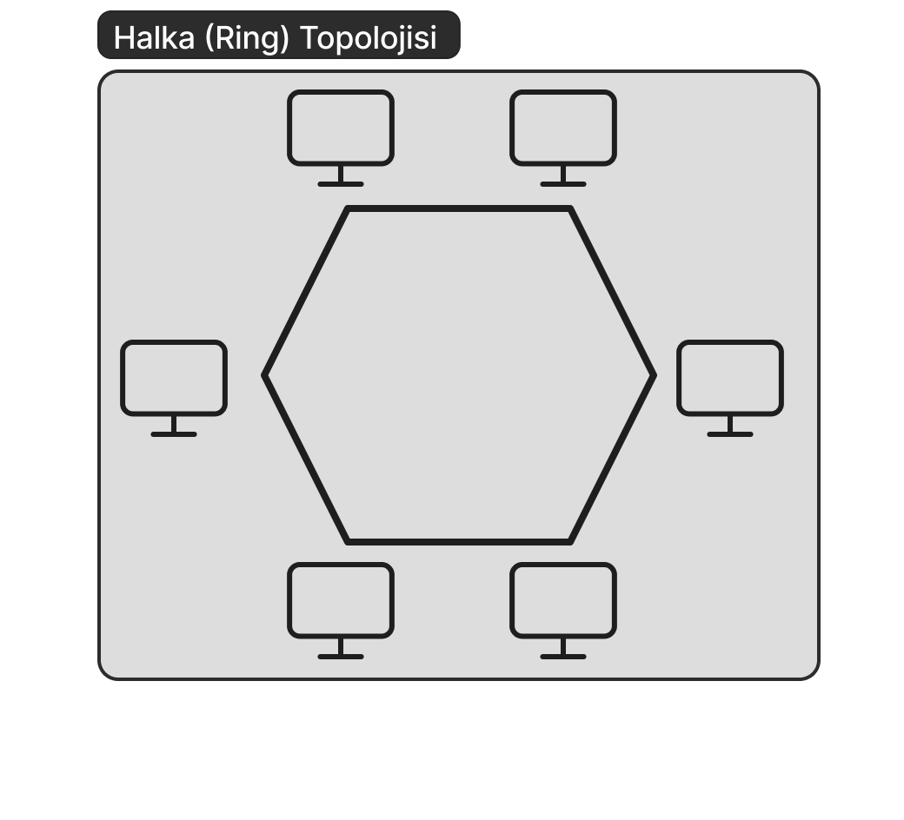
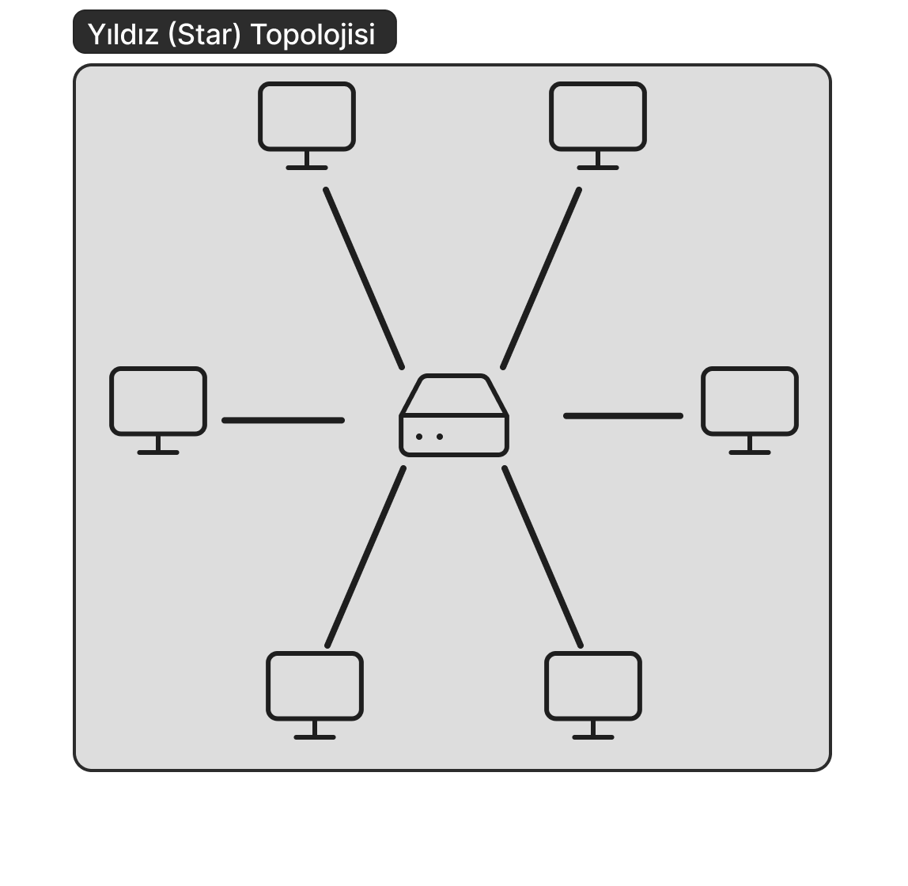
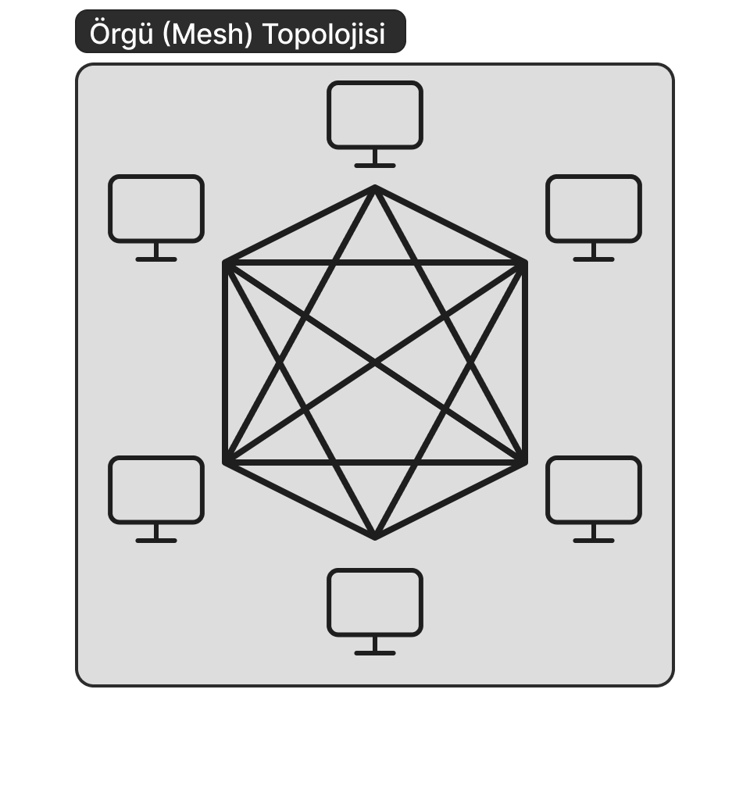
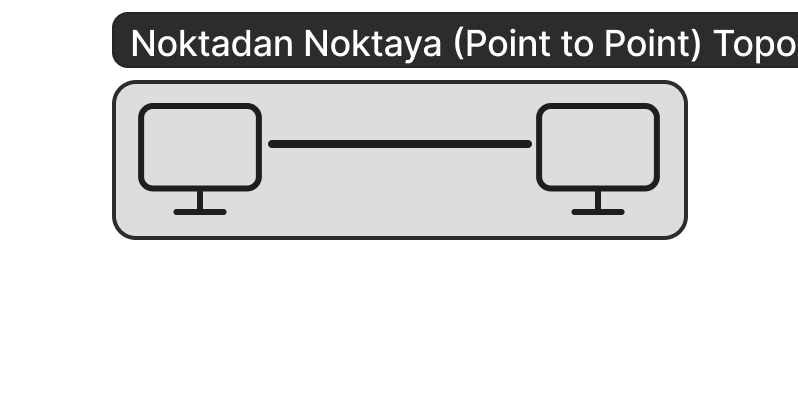
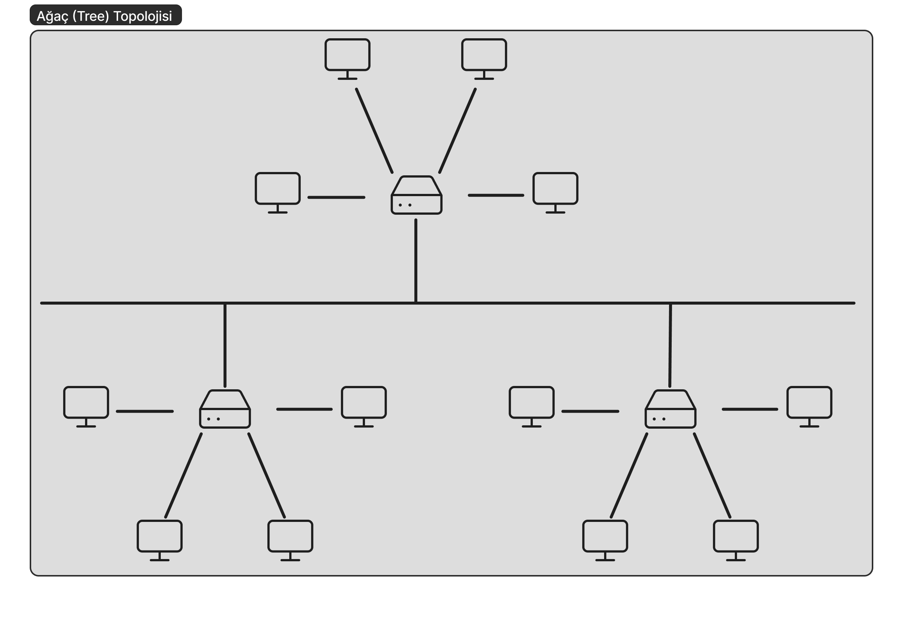

# What is Network Topology?   
Simply put, network topology can be defined as the *arrangement of the various components of a computer network*. It is possible to classify network topologies under two headings: **physical topology** and **logical topology**. In this article, I will generally talk about physical topology types, but first, let's briefly touch upon logical topology.

## What is Logical Topology?   
Logical topology refers to the type of topology that shows how network devices establish communication with each other and how data is transferred within the network.   
Now that we have covered logical topology, we can return to our main subject: physical topology.   

## What is Physical Topology?   
Physical topology is the concept used when talking about the peripherals and physical connection methods used while creating the network. The type of cable used in the structure of the network and the devices used in the network are specified in this topology. We can list the physical topology types as **bus**, **ring**, **star**, **extended star**, **mesh**, **point-to-point**, and **tree** topologies.   
Let's examine these topology types one by one.   

### Bus Topology   
In a bus topology, all devices are connected to a single backbone. Coaxial cable is typically used in this backbone. In bus topology, the signal travels through all devices. Devices check the incoming signal and, if the signal address is relevant to them, they process the signal; otherwise, they remain passive and release the signal.   
In cases where the coaxial cable used is thin, the maximum line length is 185 meters, and in cases where it is thick, it is 500 meters.   
A maximum of 30 devices can be connected to the network, and there are terminators at both ends of the backbone. Since the signal travels through all devices on the line until it reaches the target device, network performance is low.   

To summarize bus topology;   
#### Advantages:   
- The network is easy to set up.   
- It is easy to add new devices to the network.   
- It is economical.   
- Since all devices are lined up on a single backbone, cable usage is low.   
- No Switch/Hub is required.   
   
#### Disadvantages:   
- The number of devices that can be connected to the network is limited.   
- Line length is limited. (185 meters for thin cable, 500 meters for thick cable.)   
- Any problem occurring in the backbone affects the entire network.   
- It is difficult to identify and resolve problems.   
- Bandwidth is low.   
- Every new device added decreases network performance.   
   
### Ring Topology   
In a ring topology, as the name suggests, all devices are connected to each other in the form of a ring. The sent data visits all devices one by one until it reaches the receiver. Signals are transmitted unidirectionally from one device to another. In other words, each device is a receiver for the previous device and a sender for the next device. Since the incoming signal is regenerated at each unit, signal attenuation is at the lowest level.   
Data on the network is sent with a 3-byte packet called a "token." This packet circulates through all devices until it reaches the receiver. In a ring topology, there is a [MAU (Multistation Access Unit)](https://networkencyclopedia.com/multistation-access-unit-mau/) at the center.   
Considering a network consisting of 50 devices, data sent from the first device to the last device will reach the receiver after visiting 49 devices one by one.   

To summarize ring topology;   
#### Advantages:   
- There is no need for any server.   
- All devices in the network have the same authority.   
- Expanding the network has a low impact on performance.   
- It is easy to set up.   
- The probability of collision is minimal in these types of topologies.   
   
#### Disadvantages:   
- The cost is high because the amount of cable used is high and the MAU is expensive.   
- A failure in any of the devices affects the entire network.   
   
### Star Topology   
It is the type of topology created by connecting each device to a switch or hub located at the center. Data coming from the sender first goes to this central switch or hub, and from there, it is transmitted to the receiving device.   
It is the most common topology type used today. The connection between devices is provided by twisted pair cables. The distance of the devices connected to the network to the hub or switch can be a maximum of 100 meters. In cases where this length is exceeded, significant drops in performance occur.   

To summarize star topology;   
#### Advantages:   
- It is easy to add new devices to the network.   
- It is easy to detect a problem occurring in the network.   
- A failure in any of the connected devices does not affect the rest of the network.   
- Its structure and understanding are quite simple.   
   
#### Disadvantages:   
- Any failure in the central hub or switch affects the entire network.   
- Cable usage is high compared to other topologies.   
   
### Mesh Topology   
In mesh topology, every device in the network is directly connected to all other devices. It is mostly used between Wide Area Networks (WAN). In a scenario where the number of devices connected to the network is $N$, the number of connections on the network is $N(N-1)/2$.   
Since every device establishes a connection with every other device, if any connection in the network is broken, data can reach the receiver using other connections.   
There are two types: full mesh and partial mesh. In full mesh, all devices establish direct connections with each other, while in partial mesh, there are cases where a device does not establish connections with all other devices.   
The main prominent features of this topology can be listed as scalability, flexibility, robustness, and consistent data transfer. In addition, the fact that there is no need for any center in this topology is another one of its prominent features.   

To summarize mesh topology;   
#### Advantages:   
- Any failure in one of the devices does not affect the network in general.   
- Data transmission speed is quite high.   
- In cases where the network needs to be expanded, it is easy to add new devices to the network because other connections are not affected.   
   
#### Disadvantages:   
- It has a complex structure due to the very high number of connections.   
- Since every device is connected to each other, a lot of cable is required; naturally, the cost is high.   
   
### Point-to-Point Topology   
It is the most basic topology consisting of one receiver and one sender. In this topology, data transfer can be unidirectional as well as bidirectional. The connection can be established via a cable or wirelessly.   
Since it only consists of a receiver and a sender, it is in an advantageous position in terms of data security.   

To summarize point-to-point topology;   
#### Advantages:   
- It has high bandwidth.   
- Since a connection is established between only two devices, it is quite fast and secure.   
- It is easy to install and maintain.   
   
#### Disadvantages:   
- Since there is a single connection between the devices, the network collapses if this connection is damaged.   
- Again, since it is a connection consisting of only two devices, the network becomes unusable if either of the two devices breaks down.   
   
### Tree Topology   
It is basically a topology formed as a combination of star and bus topologies. It is created by gathering branches created in a star shape on a backbone.   
In another aspect, tree topology shows similarity to extended star topology. The difference between them is that no central node is needed in tree topology.   
Tree topology is used to form the backbone of large networks.   
It can be created in two different structures: **backbone tree** and **binary tree**. In the backbone tree layout, all nodes are divided into sub-branches in a hierarchical order. In the binary tree layout, each node forms the structure by dividing into only two branches. In tree topology, the flow of data is in a hierarchical order. Therefore, this topology is also called **Hierarchical Tree Topology**.   
 
To summarize tree topology;   
#### Advantages:   
- A failure in the connection between sub-devices does not affect the network in general.   
- Error detection is easy.   
- Products from different hardware manufacturers can work in harmony.   
   
#### Disadvantages:   
- Depending on the type of cable used, the distance between sub-devices may be limited.   
- A failure in the main backbone causes the entire network to collapse.   
- In case of excessive traffic on the main backbone, collisions and delays may occur.   
   
## Summary   
Network topology is the structure that determines how devices in a computer network are connected and how the data transmission process works. While logical topology shows how data flows within the network, physical topology defines how devices are physically connected.   
One of the most common physical topologies is the star topology; here, all devices are connected to a central point, making it easy to manage, but if there is a problem at the center, the entire network is affected. Bus topology provides communication over a single line, but performance decreases as the number of devices increases. In ring topology, data circulates through devices in order; this structure prevents collisions, but if a device fails, the entire network may be disrupted. Mesh topology is a secure but costly structure where every device is connected to the others. Point-to-point topology provides the simplest connection but only works between two devices. Tree topology, on the other hand, is used for large networks and ensures that data is transmitted in a hierarchical order.   
In conclusion, each topology has its own unique advantages and disadvantages. By choosing the most appropriate structure according to the area of use, the performance and reliability of the network can be ensured.