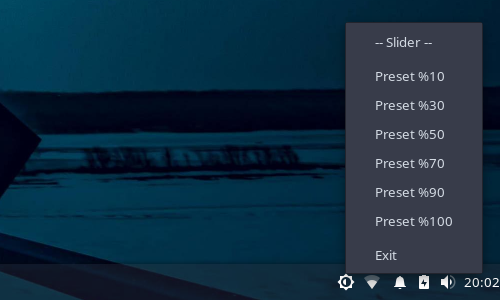
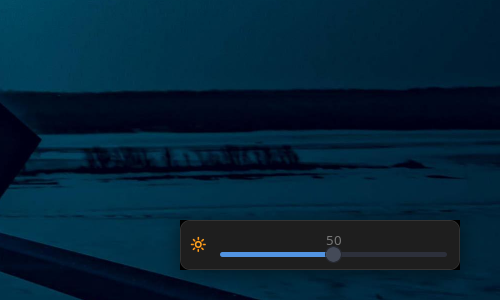

# ddc-gui

Linux üzerinde DDC/CI kullanarak harici monitör parlaklığını kontrol eden hafif bir sistem tepsisi uygulaması.

Çoğu Linux masaüstü ortamı, harici monitör parlaklığını DDC/CI üzerinden kontrol etmek için basit ve güvenilir bir yöntemden yoksundur. Bu proje; minimal, hızlı ve yerel hissettiren bir çözüm sunmayı amaçlar.

---

## ✨ Özellikler

* Sistem tepsisi (AppIndicator) entegrasyonu
* Hızlı parlaklık ön ayarları
* Açılır kaydırıcı (slider) ile hassas kontrol
* Minimal ve hafif (GTK3 tabanlı)
* `ddcutil` ile uyumlu çalışma

---

## 📸 Ekran Görüntüleri

| **Ön Ayar Menüsü** | **Kaydırıcı** |
| --- | --- |
|  |  |

---

## ⚙️ Gereksinimler

* Linux (X11)
* `ddcutil`
* Python 3
* GTK 3 bağlamaları (`python3-gi`)
* `libayatana-appindicator3`

### Bağımlılıkların Kurulumu (Debian/Ubuntu)

```bash
sudo apt install ddcutil python3-gi gir1.2-gtk-3.0 gir1.2-ayatanaappindicator3-0.1
```

---

## 🚀 Kullanım
Çalıştırmadan önce monitörünüzün algılandığını doğrulayın:

```bash
ddcutil detect
```

```bash
python3 main.py
```

## 🔄 Otomatik Başlatma

Uygulamanın giriş yapıldığında otomatik olarak başlaması için bir `.desktop` dosyası oluşturun:

```bash
mkdir -p ~/.config/autostart
nano ~/.config/autostart/ddc-gui.desktop
```

Aşağıdakileri yapıştırın:

```ini
[Desktop Entry]
Type=Application
Name=ddc-gui
Exec=python3 /tam/dosya/yolu/main.py
Icon=display-brightness-symbolic
Terminal=false
X-GNOME-Autostart-enabled=true
```

> `/tam/dosya/yolu/main.py` kısmını projenizin gerçek yoluyla değiştirin.

---

### Alternatif (Önerilen)

Eğer uygulamayı sistem genelinde kurduysanız, şu şekilde basitleştirebilirsiniz:

```ini
Exec=/usr/bin/python3 /tam/dosya/yolu/main.py
```

---

### Notlar

* Betiğin çalıştırılabilir olduğundan emin olun:

  ```bash
  chmod +x main.py
  ```
* Bazı masaüstü ortamlarında kurulumdan sonra oturumu kapatıp açmanız gerekebilir.
* Kullanıcınızın I2C cihazlarına erişim izni olduğundan emin olun (genellikle `i2c` grubuna dahil edilerek sağlanır).

---

## ⚠️ Bilinen Sorunlar

* Bus ID şu anda kod içerisinde sabitlenmiş (hardcoded) durumdadır.
* Parlaklık, başlangıçta senkronize edilmez.
* Çoklu monitör desteği sınırlıdır.
* Hata yönetimi minimal düzeydedir.

---

## 🗺️ Yol Haritası

* [ ] Monitörü otomatik algılama (DDC bus)
* [ ] Başlangıçta mevcut parlaklığı senkronize etme
* [ ] Çoklu monitör desteği
* [ ] Yapılandırma dosyası (config) desteği
* [ ] Paketleme (.deb)
* [ ] Geliştirilmiş hata yönetimi

---

## 📜 Lisans

[GPLv3 Lisansı](LICENSE)

---

## 🤝 Katkıda Bulunma

Katkılar, hata bildirimleri ve öneriler her zaman bekleriz.