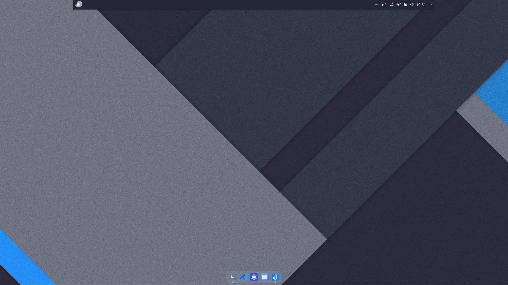

## Why Budgie?
My Linux journey began in August 2024 with Xubuntu. Like almost everyone new to Linux, I immediately caught the distro-hopping bug. After spending about a month on Xubuntu, I tried Solus Budgie and genuinely fell in love with the Budgie desktop. Over time, however, the limited Solus repositories and the fact that the Mutter stack felt quite heavy on my hardware pushed me to switch distros once again. I returned to Debian-based setups, this time diving into tiling window managers.

Throughout that roughly two-year span, I experimented with many WMs and desktop environments—including i3wm, XFCE, bspwm, and KDE. Yet none of them offered the clean simplicity I found in Budgie. A few weeks ago, I made the jump to Ubuntu Budgie. Based on my initial impressions, it looks very much like it will be my final distro.

## First Impressions
In its transition from Xorg to Wayland, the Budgie desktop moved away from Mutter in favor of labwc. I experienced this for the first time on Ubuntu Budgie, and I was genuinely impressed by how it manages to combine a lightweight footprint with a modern look and feel. The Crystal Dock at the bottom was perfect for pinning my daily apps. The top panel, however, had an odd quirk.

While the panel looked fine at a glance, it sat right in the center of my 1080p (1920px) external display looking like a giant dock. Weirdly enough, it was locked to the width of my laptop screen (1366px).



Since I didn't have time to troubleshoot it right away and it didn't break my workflow, I lived with this "pseudo-dock" for a bit. Today, having some free time, I decided to fix it and tried a few straightforward approaches.

## What I Tried, What Happened
I started by simply removing and recreating the panel. It didn't take long to realize that changed nothing—it spawned with the exact same dimensions. Next, with some AI assistance, I modified the labwc environment configuration. The logic sounded great on paper, but my setup didn't appreciate the change.

Then I approached it with a basic question: "What happens to the panel size if the laptop screen isn't there at all?"

I disabled the laptop display in the display settings and rebooted. It worked. The panel spanned the full 1920px across the monitor. I re-enabled the laptop screen, and the panel stayed intact. But after another reboot, I was right back to square one.

While I know basic Bash, writing complex shell scripts isn't my forte yet, so I shared my findings with Gemini. The root cause was straightforward: during boot, the laptop screen initializes a fraction of a millisecond earlier than the external monitor. The panel renders once against that smaller screen size and then gets mapped over to the external display while retaining the laptop's width. In short, if I could temporarily take the internal display out of the equation during startup, the panel would render directly against the external monitor's resolution.

Gemini grasped the issue and generated this quick script:

```Bash
#!/bin/bash

# Wait until the Wayland socket and outputs are ready (max 5 seconds)
for i in {1..50}; do
    if wlr-randr >/dev/null 2>&1; then
        break
    fi
    sleep 0.1
done

# Apply fix if the external monitor is connected
if wlr-randr | grep -q "HDMI-A-1"; then
    # Temporarily disable the internal display
    wlr-randr --output eDP-1 --off
    budgie-panel --replace &
    
    # Allow the panel to initialize its layer-shell surface
    sleep 0.8
    
    # Restore the internal display to its position and refresh rate
    wlr-randr --output eDP-1 --on --pos 1920,312 --mode 1366x768@60.012001Hz
fi
```
To run this automatically on startup, we just need a desktop autostart entry:
```Ini
[Desktop Entry]
Type=Application
Name=Budgie Panel Multi-Monitor Fix
Exec=/bin/bash /home/oguzhan/.local/bin/fix-panel.sh
Hidden=false
NoDisplay=false
X-GNOME-Autostart-enabled=true
```

Important Note: If you plan to use this script and desktop file directly, make sure to adjust the username path and your specific monitor output names.

## The Result
My panel is finally a real panel again instead of an awkward mock-dock. Is this an elegant piece of engineering? Not really—it's brute-force. But it works. Until upstream Budgie developers patch this behavior under Wayland, sometimes you just have to give the system a little nudge.

If you'd like to try this out, I've pushed an updated version of the script that automatically detects connected monitors to my [GitHub Profile](https://github.com/kuscadev/budgie-wayland-panel-fix). Since these scripts are AI-assisted, make sure to review the code before running them on your primary machine.